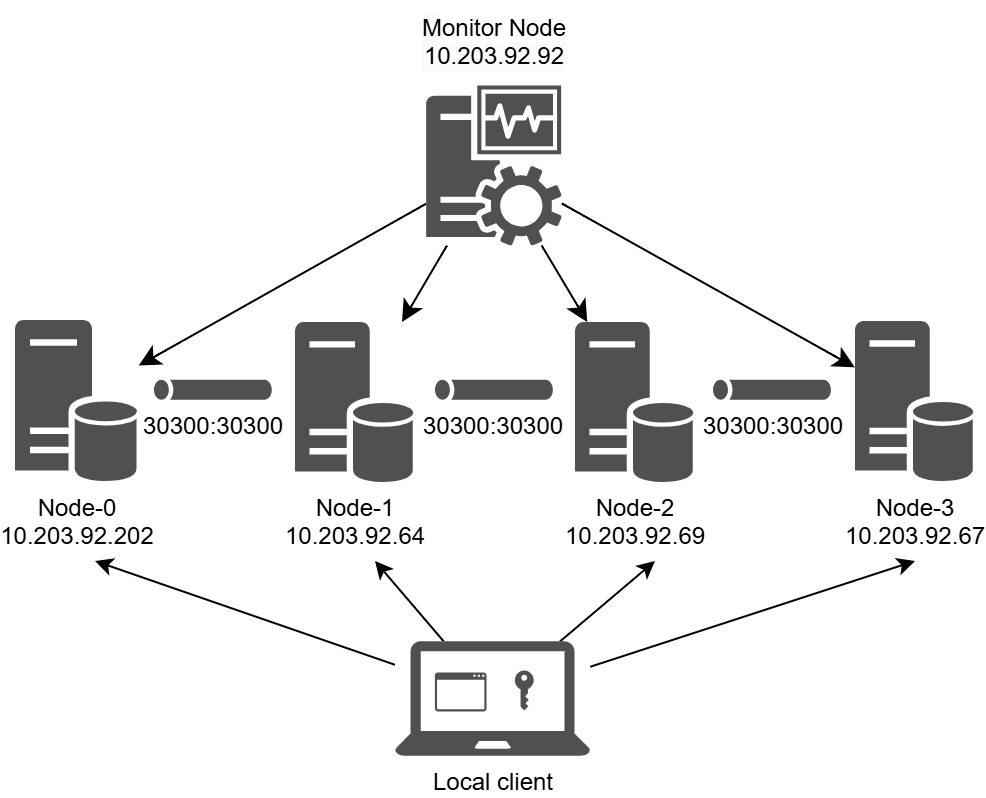
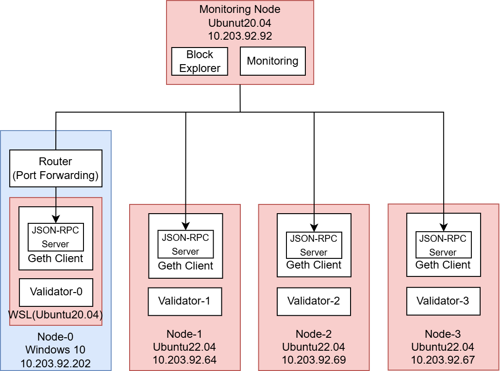

# Blockchain

## Overview

ブロックチェーンの環境構築の方法について説明する。
本システムでは、プライベートのEthereum系ブロックチェーンの環境を構築する。
Ethereum系ブロックチェーンでは、EVM(Ethereum Virtual Machine)によってスマートコントラクトが実行される。
本環境では、EVMによってSolidityの実行が可能な環境を構築する。

現在の[Hardhat](https://hardhat.org/)を活用した開発環境のシステムでは、実際のWeb3サービスを提供するための本番環境として活用する際に課題が存在する。

1. データの初期化：Hardhatを活用した環境では、ブロックチェーンを起動する度に状態が初期化されてしまう
2. ウォレットの同期ずれ：ウォレットはデータが変更されないブロックチェーンの環境で最適化されているため、キャッシュ削除などの工程を実行の度に実施する必要がある

本環境では、データの永続化を解決することでウォレットとの同期ずれも解消する。

### Node Structure

本ブロックチェーン環境では、4つのブロックチェーンノードと1つの監視用ノードでシステムが構成される予定である。
これらのブロックチェーンノードの数は、必要に応じて変更することが可能である。
以下に4台で構成されているノードの構成を示す。



Node-0(spade)
- ブロックチェーンノード
- IPアドレス：10.203.92.202
- OS：Ubuntu20.04(WSL)
- ポート
    - 22000(RPC-URL HTTP)
    - 32000(RPC-URL WS)
    - 30300(P2P)
    - 20(SSH)
- Windows10にWSLをインストール
- ポートフォワーディングを設定してWindowsからWSLに接続

Node-1(club)
- ブロックチェーンノード
- IPアドレス：10.203.92.64
- OS：Ubuntu22.04
- ポート
    - 22000(RPC-URL HTTP)
    - 32000(RPC-URL WS)
    - 30300(P2P)
    - 20(SSH)
- 外部HDDにOSをインストール

Node-2(diamond)
- ブロックチェーンノード
- IPアドレス：10.203.92.69
- OS：Ubuntu22.04
- ポート
    - 22000(RPC-URL HTTP)
    - 32000(RPC-URL WS)
    - 30300(P2P)
    - 20(SSH)
- 外部SSDにOSをインストール

Node-3(heart)
- ブロックチェーンノード
- IPアドレス：10.203.92.67
- OS：Ubuntu22.04
- ポート
    - 22000(RPC-URL HTTP)
    - 32000(RPC-URL WS)
    - 30300(P2P)
    - 20(SSH)
- 外部SSDにOSをインストール

Monitor Node
- 監視用ノード
- IPアドレス：10.203.92.92
- OS：Ubuntu20.04
- ポート
    - 25000(Block Explorer)
    - 8086(InfluxDB)
    - 8085(Grafana)

以下にシステムアーキテクチャを示す。
- ブロックチェーンノード：
    ブロックチェーンを構成するためのノードである。
    Geth(go-ethereum) Clinetは、ブロックチェーンを構成するシステムとしてトランザクションデータの保存や他ノードとの通信などを行う。
    Validatorはトランザクションデータの検証を担う。
- 監視ノード：
    ブロックチェーンノードのシステムの状態を監視するためのノードである。
    Block Explorerはブロックの状態を確認することが可能である。
    Monitoringはブロックチェーンノードの各メトリクスデータを収集して状態を監視することが可能である。



### Monitoring Structure


## Set Up

### Required Tools

以下が必要なツールである。Goとgo-quorum、nvmのインストールの方法は後ほど説明する。

ブロックチェーンノード
- Go(v1.24.0)
- GoQuorum(v24.4.1)

監視ノード
- Docker
- docker-compose(v3)
- curl
- nvm
- node

ローカル端末
- curl
- vim
- nvm
- node

### Install Go

詳しいインストール方法は[Download and install - The Go Programming Langage](https://go.dev/doc/install)を参照する。

圧縮されたバイナリファイルを取得する。
```bash
wget https://go.dev/dl/go1.24.0.linux-amd64.tar.gz
```

取得したファイルを解凍し、バイナリファイルを展開する。
```bash
tar -C /usr/local -xzf go1.24.0.linux-amd64.tar.gz
```

コマンドで利用できるように `~/.profile` に書き込む。
```bash
# set PAHT so tit includs user's private bin if it exists
if [ -d "/usr/local/go/bin" ] ; then
    PATH="$PATH:/usr/local/go/bin"
fi
```

コマンドで利用できるように `~/.profile` の設定を読み込む。
```bash
source ~/.profile
```

Goの動作確認をする。
```bash
go version 
```

### Install GoQuorum

詳しいインストール方法は、[Install binaries | ConsenSys GoQuorum](https://docs.goquorum.consensys.io/deploy/install/binaries)を参照する。

圧縮されたバイナリファイルを取得する。
```bash
wget https://artifacts.consensys.net/public/go-quorum/raw/versions/v24.4.1/geth_v24.4.1_linux_amd64.tar.gz
```

展開先のフォルダーを作成する。
```bash
sudo mkdir -p /usr/local/geth/bin
```

取得したファイルを解凍し、バイナリファイルを展開する。
```bash
tar -C /usr/local/geth/bin -xzf geth_v24.4.1_linux_amd64.tar.gz
```

コマンドで利用できるように `~/.bashrc` に書き込む
```bash
# Go-Quorum PATH
PATH=$PATH:/usr/local/geth/bin
```

`~/.bashrc` の設定を読み込む。
```bash
source ~/.bashrc
```

gethの動作確認をする。
```bash
geth version
```

### Install nvm

バイナリファイルをダウンロードする。
```bash
curl -o- https://raw.githubusercontent.com/nvm-sh/nvm/v0.40.2/install.sh | bash
```

`~/.bashrc` の設定を読み込む。
```bash
sourse ~/.bashrc
```

nvmを用いてnodeをインストール
```bash
nvm install v22.14.0
```

現在のnodeのバージョンを変更
```bash
nvm use v22.14.0
```

## Config

### Config Blockchain Nodes

`※以下のコマンドはローカル端末で行う。`

[quorum-genesis-tool](https://github.com/Consensys/quorum-genesis-tool)を活用してブロックチェーンノード設定の初期化を行う。
```bash
npx quorum-genesis-tool --consensus qbft --chainID 1337 --blockperiod 5 --requestTimeout 10 --epochLength 30000 --difficulty 1 --gasLimit '0xFFFFFF' --coinbase '0x0000000000000000000000000000000000000000' --validators 4 --members 0 --bootnodes 0 --outputPath 'artifacts'
```
- --consensus qbft: コンセンサスアルゴリズムを指定します。この場合は「QBFT (Quorum Byzantine Fault Tolerance)」を利用します。
- --chainID 1337: ブロックチェーンネットワークのチェーンIDを指定する
- --blockperiod 5: 新しいブロックが生成される間隔（秒単位）を設定する
- --requestTimeout 10: コンセンサスアルゴリズムがリクエストに対してタイムアウトする時間（秒単位）を設定する
- --epochLength 30000: コンセンサスプロセスにおいてエポックの長さ（ブロック数単位）を指定する
- --difficulty 1: ジェネシスブロックの初期難易度を指定する
- --gasLimit '0xFFFFFF': ブロックごとの最大ガス使用量を指定する
- --coinbase '0x0000000000000000000000000000000000000000': コインベース（報酬が支払われるアカウントアドレス）を指定する
- --validators 4: ネットワーク内のバリデーターの数を指定する
- --members 0: ネットワーク内の一般メンバーの数を指定する
- --bootnodes 0: ブートノード（ネットワークに最初に接続するノード）の数を指定する。
- --outputPath 'artifacts': ジェネシスブロックファイルなどの生成物を保存するディレクトリパスを指定する

ファイルをコピー変更する
```bash
mv artifacts/<現在の日時>/* artifacts
```

接続先のノードを設定する
```bash
cd artifacts/goQuorum
vim static-nodes.json
```

以下で設定する。Hostは利用するブロックチェーンノードのIPアドレスに適時書き換える。
```bash
[
"enode://7aad76ec85e2627b769eb4c8ff2ce10c379223cefa9ee2fa50b91d6e3f27e96f1862b96adc91787bf1760bb74e9db6fff3ce7841d4ed04865f265f97c0a7227f@<HOST>:30300?discport=0&raftport=53000",
"enode://4afe8d839a15d862f9e91875d65954f218bd90235687f3c0c41874b84f3633af0f86af3e5b92011c8c853a7fa25300dbc00f9b679df9416c389d3b12b0a96590@<HOST>:30300?discport=0&raftport=53000",
"enode://dd95a4d54125cd553b9b52b19f434bbd47b7b78f3fcb7a295ad2eff0f54ce755977378f1fa94cf233a25144c597e2a8010464a404a1e9073191ce51544a68565@<HOST>:30300?discport=0&raftport=53000",
"enode://a1888a8fe4710ea24e6881a944e46f210ac0f04e3e8908898aac547658c950aafed4d58134ccd40f930f758fa93b8f90188ce844e33dd2596acd524f11e053ec@<HOST>:30300?discport=0&raftport=53000"
]
```
4台構成の例)
```bash
[
"enode://7aad76ec85e2627b769eb4c8ff2ce10c379223cefa9ee2fa50b91d6e3f27e96f1862b96adc91787bf1760bb74e9db6fff3ce7841d4ed04865f265f97c0a7227f@10.203.92.202:30300?discport=0&raftport=53000",
"enode://4afe8d839a15d862f9e91875d65954f218bd90235687f3c0c41874b84f3633af0f86af3e5b92011c8c853a7fa25300dbc00f9b679df9416c389d3b12b0a96590@10.203.92.64:30300?discport=0&raftport=53000",
"enode://dd95a4d54125cd553b9b52b19f434bbd47b7b78f3fcb7a295ad2eff0f54ce755977378f1fa94cf233a25144c597e2a8010464a404a1e9073191ce51544a68565@10.203.92.69:30300?discport=0&raftport=53000",
"enode://a1888a8fe4710ea24e6881a944e46f210ac0f04e3e8908898aac547658c950aafed4d58134ccd40f930f758fa93b8f90188ce844e33dd2596acd524f11e053ec@10.203.92.67:30300?discport=0&raftport=53000"
]
```

ファイルをコピーして接続先のアクセスを許可する
```bash
cp static-nodes.json permissioned-nodes.json
```

ノードの設定ファイルを各ブロックチェーンノードへコピーする(USERとHOSTとNUMは適時書き換える)
- USER：ユーザー名
- HOST：IPアドレス
- NUM：ブロックチェーンノードの番号
```bash
scp static-nodes.json permissioned-nodes.json <USER>@<HOST>:~/QBFT-Network/Node-<NUM>/data
```
例)
```bash
scp static-nodes.json genesis.json ssdl_user@10.203.92.202:~/QBFT-Network/Node-0/data
```

ノード鍵とアドレス設定のファイルを各ブロックチェーンノードへコピーする(USERとHOSTとNUMは適時書き換える)
```bash
scp validator<NUM>/nodekey* validator<NUM>/address <USER>@<HOST>:~/QBFT-Network/Node-0/data
```
例)
```bash
scp validator0/nodekey* validator0/address ssdl_user@10.203.92.202:~/QBFT-Network/Node-0/data
```

バリデータ用のファイルを各ブロックチェーンノードへコピーする(USERとHOSTとNUMは適時書き換える)
```bash
scp validator<NUM>/account* <USER>@<HOST>:~/QBFT-Network/Node-0/data/keystore
```
例)
```bash
scp validator0/account* ssdl_user@10.203.92.202:~/QBFT-Network/Node-0/data/keystore
```

### Apply Config Blockchian Nodes

`以下のコマンドは各ブロックチェーン端末ですべて実行する`

ディレクトリを変更する
```bash
cd ~/QBFT-Network/Node-<NUM>
```

ジェネシスファイルを初期化する
```bash
geth --datadir data init data/genesis.json
```

## Start Up

###

### Start Up Blockchain Node

ディレクトリを変更する
```bash
cd ~/QBFT-Network/Node-<NUM>
```

環境変数ADDRESSにアカウントのアドレスを設定する
```bash
export ADDRESS=$(grep -o '"address": *"[^"]*"' ./data/keystore/accountKeystore | grep -o '"[^"]*"$' | sed 's/"//g')
```

環境変数PRIVATE_CONFIGに無効(ignore)を設定する
```bash
export PRIVATE_CONFIG=ignore
```

以下のコマンドでGoQuorumをバックエンドで起動する
```bash
nohup geth --datadir data --networkid 1337 --nodiscover --verbosity 5 --syncmode full --istanbul.blockperiod 5 --mine --miner.threads 1 --miner.gasprice 0 --emitcheckpoints --http --http.addr 0.0.0.0 --http.port 22000 --http.corsdomain "*" --http.vhosts "*" --ws --ws.addr 0.0.0.0 --ws.port 32000 --ws.origins "*" --http.api admin,eth,debug,miner,net,txpool,personal,web3,istanbul --ws.api admin,eth,debug,miner,net,txpool,personal,web3,istanbul --unlock ${ADDRESS} --allow-insecure-unlock --password ./data/keystore/accountPassword --port 30300 --metrics --metrics.influxdb --metrics.influxdb.endpoint "http://10.203.92.92:8086" --metrics.influxdb.username "node-0" --metrics.influxdb.password "password" --metrics.influxdb.tags "host=node-0" > geth.log &
```
